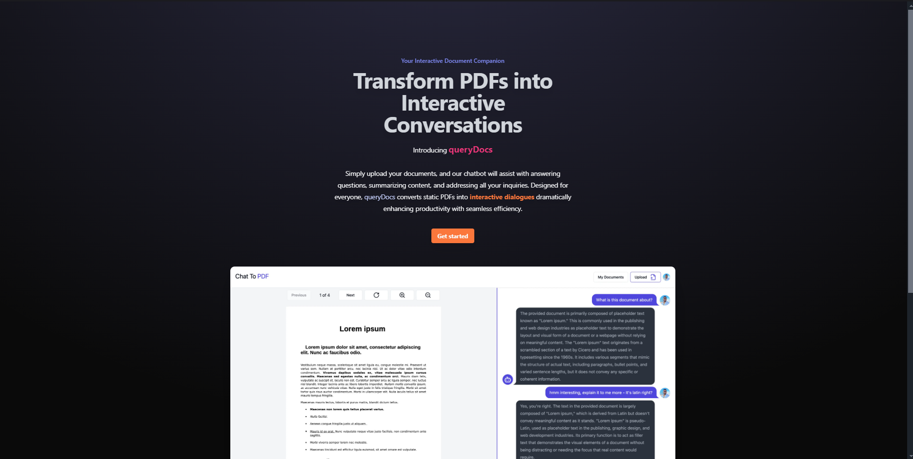

# QueryDocs



**QueryDocs** is a chat-to-PDF application that allows users to interact with PDF documents by querying them using natural language. This tool leverages AI to quickly search, retrieve, and analyze information from PDF documents in a more intuitive way than traditional text-based search methods.

---

## 🚀 Features

- **Natural Language Queries**: Ask questions directly to your PDF documents and get relevant answers.
- **Efficient Search**: Quickly search large volumes of text across multiple PDFs.
- **Intelligent Parsing**: Understands context and retrieves more accurate information than keyword searches.
- **User-Friendly Interface**: Simple and intuitive design for ease of use.
- **Real-time Results**: Get immediate responses with minimal delay.

---

## 🔧 Technology Stack

- **Frontend**: Next.js, TypeScript, Tailwind CSS
- **Backend**: Pinecone for vector search
- **AI Integration**: OpenAI's GPT models

---

## 📦 Installation

1. **Clone the Repository**:

   ```bash
   git clone https://github.com/username/AI-SaaS.git
   cd querydocs


Install Dependencies:

bash
Copy code
npm install


Set up Environment Variables:

Create a .env.local file in the root directory and add the necessary environment variables:

NEXT_PUBLIC_API_KEY=your-api-key
PINECONE_INDEX=your-pinecone-index
DATABASE_URL=your-database-url


🛠️ Usage
Upload your PDF documents.
Type your query in the search bar using natural language.
Get relevant responses, including links to specific sections of the document for further reading.
🤖 AI Capabilities
Text Extraction: Automatically parses text from PDF documents for easy querying.
Contextual Understanding: Uses advanced AI models to understand and return answers based on the document's content.
Multiple PDF Support: Handles queries across multiple documents seamlessly.
🗂️ Project Structure
plaintext
Copy code
QueryDocs/
├── public/                # Static assets
├── src/                   # Application source code
│   ├── components/        # Reusable components
│   ├── pages/             # Next.js pages
│   ├── styles/            # Tailwind CSS styles
│   └── utils/             # Utility functions
├── .env.local.example      # Example of environment variables
├── package.json           # Node.js dependencies
└── README.md              # Project documentation
📧 Contact
For any inquiries or support, feel free to reach out:

Email: danielkamaunganga3@gmail.com
Website: [Nowayte](https://nowayte.vercel.app)


